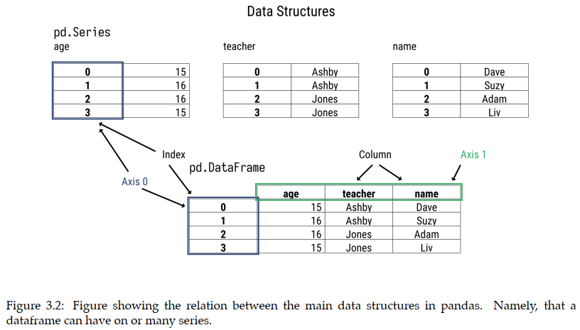

# Chapter 3: Data Structures

At the core of pandas are two data structures, **Series** and **DataFrame**, which dealing with array data and tabular data

| *Data Structure* | *Dimensionality* | *Spreadsheet Analog* | *Database Analog* | *Linear Algrebra* |
| ----------- | ----------- | ----------- | ----------- | ----------- |
| **Series** | **1D** | **Column** | **Column** | **Column Vector** |
| **DataFrame** | **2D** | **Single Sheet** | **Table** | **Matrix** |

